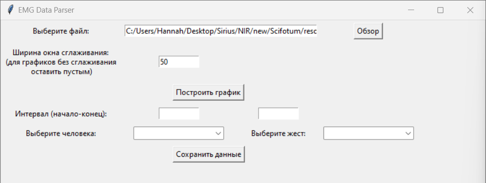
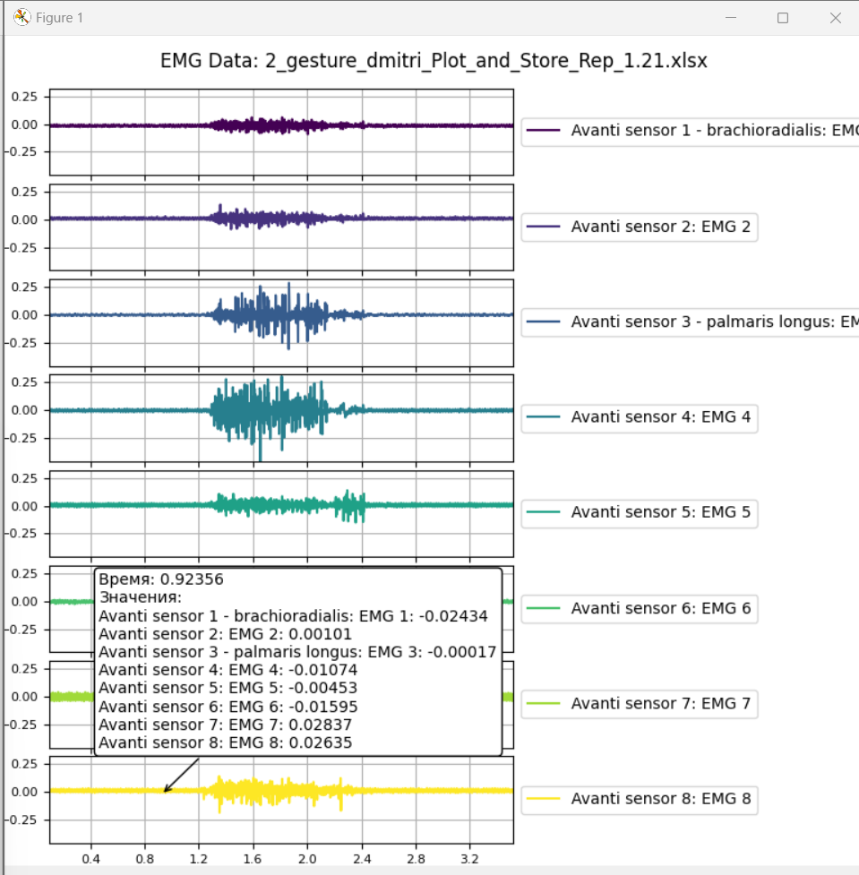
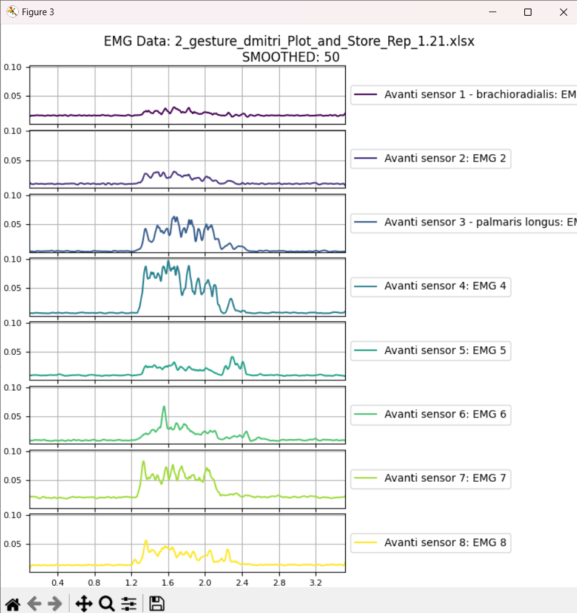

## CLEAN_EMG_PART     

### __Тут хранятся чистые файлы по следующим задачам:__  
 1. Бухштабер по неаппроксимировнным данным
 2. Тепловая карта для стенда конференции

Изначальные данные от нейробио в папке __raw_data__
__________
### __Для обеих задач обработка данных (автоматизировать):__  
1. обрезка данных от краевых 0
2. смещение данных по изолинии
3. обрезка движений (+ спокойствие)
4. сохранять в структуру как-то с ид человека и номером жеста
5. UI для дорогих нейробио

Данные после обработки должны лежать в json  
+должен быть еще словарь(json) с номерами людей. Чтоб id хранить

UPD: Как выглядит интерфейсик для нарезки, сглаживания и тд:

_______________
### __Для стенда:__
1. Берем обработанные данные. Аппроксимация данных(библиотеки для нейробио сигнала neurokit или математика)
2. Отстроить тепловые карты для всех видов движений(либы?)
3. Усредняем для всех людей (для всех движений)? Или строим для каждого человека отдельно?
   **(АЛИСА) Для каждого отдельно**
4. Что делаем с тем, что жесты по времени разные? строим все или одинаковое количество итераций? (я бы строила одинаковое количество точек просто)
   **(АЛИСА) Берем за 100 процентов**

### __Для бухштаббрера:__  
1. Кто такая ваша математика?!?!?!?!?
2. Жесты берем по 4 проекциям, отстраиваем попарно по 2 проекции. Смотрим глазами  
__НА ОДНОМ РИСУНКЕ одни и те же проекции:__  
жесты в разных столбцах
данные в разных строках