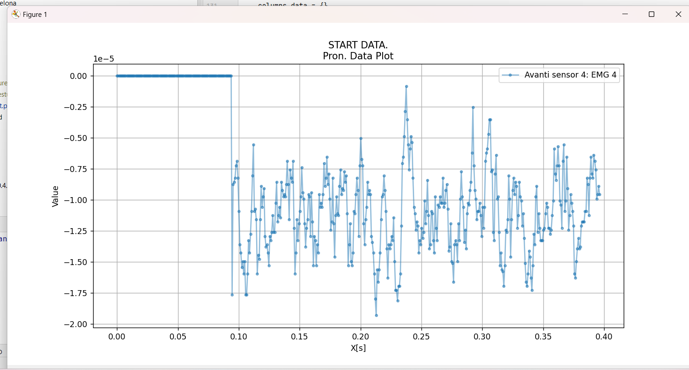
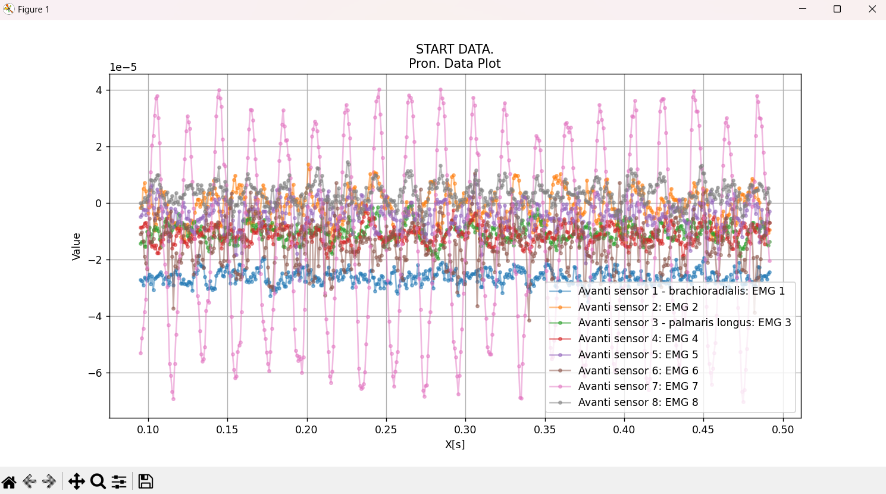
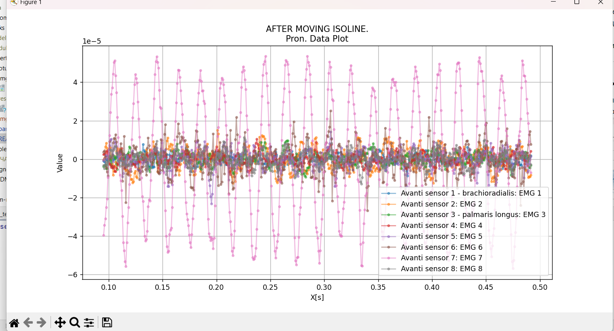
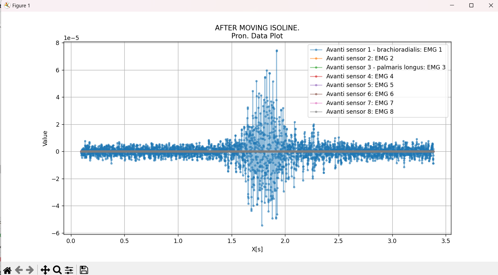
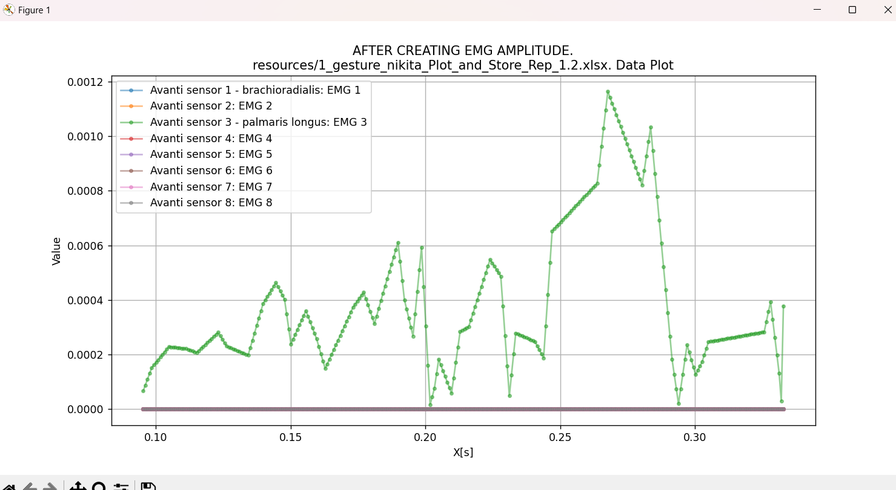
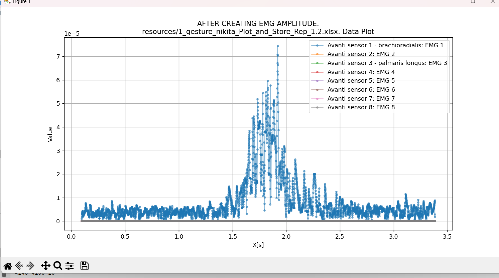
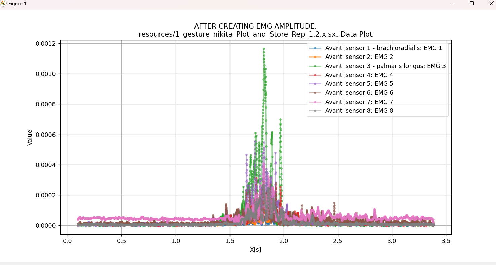

### Построение тепловой карты для жестов руки  

(Алиса Позднякова)

### Жесты
1) Расслабленное -> кулак
2) Расслвбленное -> ладонь
3) Расслабленный кулак -> отгибание большого пальца

#### TODO:
1) Подрезать файлы (по одному движению: определить начало, конец движения)
2) Построить тепловую карту(линию) для одного момента времени
3) Построить для всего жеста
4) Для множества жестов
5) ????? Проанализировать тепловые карты 

_______________
### (Mixim smalltalk)
Раньше делали отдельные участки, а мы - браслет

Есть активная часть

Мышечная координация сегментарной активности
#### TODO:

0) найти изолинию (выровнять все по среднему/медиане)
1) Глазами самую крутую Линию (просто график)
2) перевести колебания в плюс (новое_iзначение = начальное_i - начальное_i-1)
   1) искать соседние (минимальную меньше 0 и максимальную больше 0) и см модуль между ними
   2) ++ --
3) строить интеграл
4) обрезаем отсутствия движения (если отклонилось от 0 причем дольше чем на ??? 2 ??? мс)
5) 3 карты (условно 8х10) покой, движение в начале максимальное значение и за секунды до возвращения + состояние покоя
6) Анализировать пока не надо. Только визуализация

___
### Пояснения (неочевидные костыли)

В начале и в конце файлов есть 0 значения (см рисунок) из-за этого перед нахождением изолинии их надо срезать

До смещения изолинии:

После:

После поиска максимумов в + и  в -.... Ну не очень гладкая...

